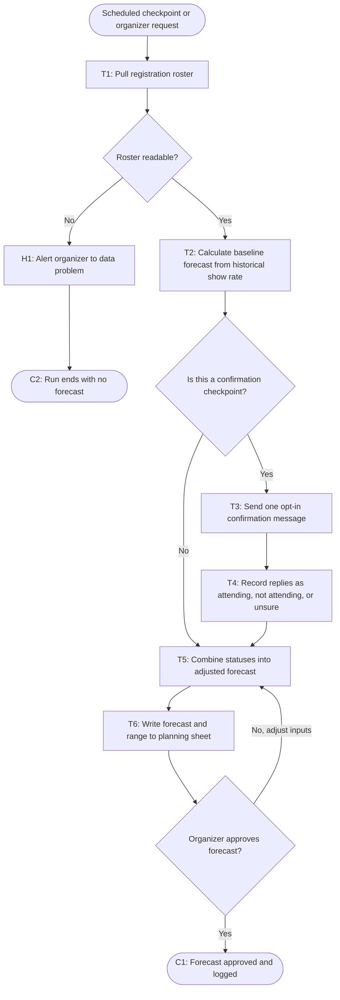

# Workflow of Tasks

## 1. Workflow Overview

### 1.1 Workflow Goal
This workflow supports the system goal defined in `my_first_agent/README.md`.

### 1.2 Workflow Trigger

A run begins at a scheduled forecast checkpoint tied to the event date: 14 days out, 7 days out, 48 hours out, and 12 hours before doors open. An organizer can also start a run on demand when a vendor requires a count earlier than the next scheduled checkpoint.

### 1.3 Completion Condition at Runtime

A run is complete when a forecast record containing a predicted attendance number, a confidence range, and the registration and confirmation counts it was derived from has been written to the club planning sheet and an organizer has marked that record as approved. A run also ends, without a forecast, if the registration roster cannot be read and an organizer has been alerted.

### 1.4 General Workflow

On the normal path, the run pulls the current registration roster from the club registration form and checks that it is readable. It then calculates a baseline forecast by applying the historical show rate from past club events to the current registration count. If the checkpoint is one of the two designated confirmation checkpoints, at 7 days and at 48 hours, the system sends each registrant who has not yet responded a single opt-in confirmation message and records the replies as attending, not attending, or unsure. No registrant receives more than two messages across the entire event cycle, and the 14-day and 12-hour checkpoints are forecast-only. The system then combines confirmed, declined, and unconfirmed registrants into an adjusted forecast with a confidence range, writes that forecast and its inputs to the club planning sheet, and presents it to an organizer.

Two exception paths matter. If the roster cannot be pulled or parsed, the run stops and alerts an organizer rather than producing a forecast from stale data. At the review point, if the organizer does not approve the forecast, they adjust the inputs — for example correcting the historical show rate or excluding a duplicate registration — and the system recombines the statuses and produces a revised forecast. That loop repeats until the organizer approves a record, which is the only way a run ends with a forecast in place. The system never places an order or commits club funds; the organizer does that outside the workflow.

### 1.5 Workflow Diagram

